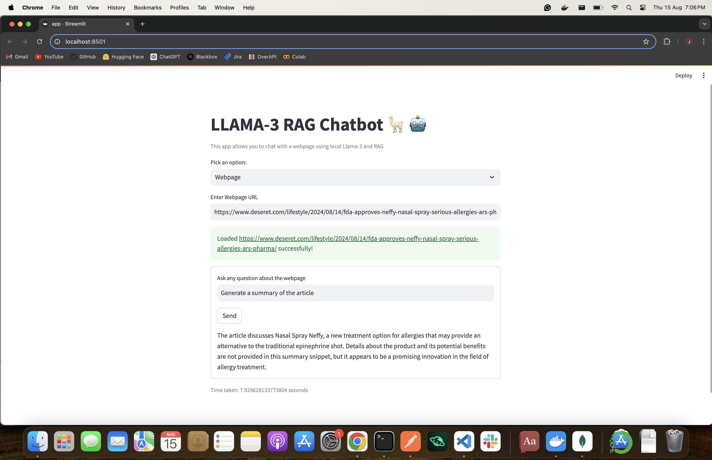

# LLAMA-3 RAG for PDFs and Websites

## Overview
This project is a implementation of the LLAMA-3 Retrieval-Augmented Generator (RAG) model for working with PDFs and websites.

## Getting Started
### Prerequisites
- Python 3.11+
- pip
- ollama (llama3)

Learn how to install ollama and llama3 [here](https://ollama.com/library/llama3)

### Installation 

        pip install -r requirements.txt

## Usage
1. Make sure ollama is running

    Run: 

        ollama serve

    If you receive a message like ```port already in use```, it means ollama is already serving. 

2. Start the app:

        
        streamlit run app.py


## Features
- Support for PDFs and websites
- Implementation of LLAMA-3 RAG model


## Docker

Build the image:

        docker build -t llama3-rag:latest .

Run the container:

        docker run -p 8080:8888 llama3-rag:latest

## Sneak Peek
